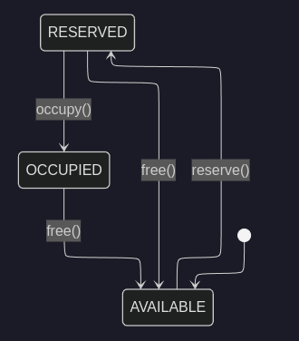
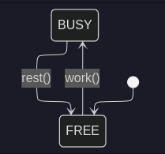
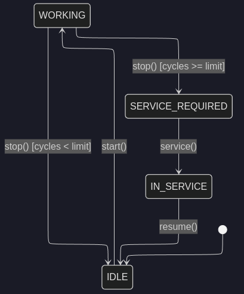
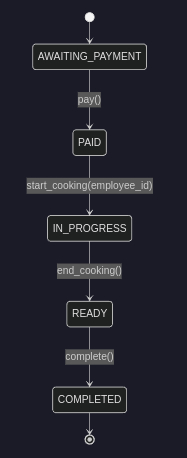
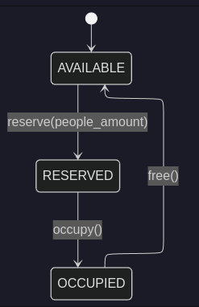

# Cafe Manager (Cafma)

A robust CLI and Web application for comprehensive cafe management built with Python

## Features

The application is divided into logical domains:

*   **Environment (`cafe`)**: Support for multiple separate cafe databases (multi-tenancy).
*   **Finance (`finance`)**: Track budget, investments, transactions, and profit/loss statistics.
*   **Orders & Kitchen (`order`, `kitchen`)**: Full lifecycle of an order (awaiting payment -> paid -> cooking -> ready -> served).
*   **Menu & Inventory (`menu`, `inventory`)**: Manage menu items, recipes, ingredient supplies, and auto-deduct stocks during cooking.
*   **Equipment (`table`, `chair`, `machine`)**: Buy equipment, manage seating capacity, make reservations, and track coffee-machine maintenance.
*   **People (`employee`, `client`)**: Hire/fire staff, track employee workload, and manage client loyalty/spending.

## Technology Stack

*   **Language:** Python 3.11+
*   **CLI Framework:** [Typer](https://typer.tiangolo.com/)
*   **Web Framework** [FastAPI](https://fastapi.tiangolo.com/) 
*   **Web UI** [NiceGUI](https://nicegui.io/)
*   **Database:** [SQLite](https://sqlite.org/)
*   **Server:** [Uvicorn](https://uvicorn.dev/)

## Installation

1. Clone the repository and navigate to the project directory:
   ```bash
   git clone https://github.com/Frog-with-Code/Cafe-manager
   cd cafe_manager
   ```

2. Create and activate a virtual environment:
   ```bash
   python -m venv .venv
   source .venv/bin/activate
   ```

3. Install package
    ```bash
    uv sync
    ```

## Quick Start

### Web

To start using Cafma Web Application, you need start backend and frontend modules:

**1. Open terminal and paste following command:**
```bash
cafma-web
```

**2. Open another terminal and paste following command:**
```bash
cafma-ui
```

### CLI

To start using Cafma, you need to create a database environment and initialize your cafe.

**1. Create and activate a new cafe environment:**
```bash
cafma create my_cafe
cafma cafe activate my_cafe
```

**2. Initialize the cafe (set name, address, and starting capital):**
```bash
cafma init --name "Central Perk" --address "New York" --capital 5000
```

**3. Explore available commands:**
Use the `--help` flag at any level to see available commands and options.
```bash
cafma --help
cafma order --help
cafma order create --help
```

### Basic CLI Usage Example:
```bash
# Buy a table and chairs
cafma table buy --seats 4 --price 150
cafma chair buy --price 30

# Hire an employee
cafma employee hire --name "Gunther"

# Check finance stats
cafma finance stats
```

## Project Structure

The project strictly separates concerns:
*   `domain/`: Contains enterprise logic, entities, domain services, interfaces of services and repositories. Does not depend on any other layer.
*   `application/`: Contains Use Cases (handlers) and interface for Unit of Work.
*   `infrastructure/`: Contains infrastructure services implementation, dependency injection factory and SQLite implementations of Repositories, handling direct DB connections and SQL queries.
*   `cli/`: CLI presentation layer. Contains Typer setups, data validation, and console rendering using Rich.
*   `web/`: Web presentation layer. Contains FastAPI setups, data validation and NiceGUI interface.

Here is a draft for your `README.md` written in a professional, technical, and objective tone.

---

## Web Architecture

### Component Overview

1. **Backend**
   * **Framework:** FastAPI
   * **ASGI Server:** Uvicorn
   * **Host:** `127.0.0.1` (localhost)
   * **Port:** `8000`
   * **Role:** Manages core business logic, data processing, and exposes REST endpoints.

2. **Frontend**
   * **Library:** NiceGUI
   * **Host:** `127.0.0.1` (localhost)
   * **Port:** `8080`
   * **Role:** Renders the user interface and captures user inputs.

### Communication Flow

The frontend and backend run as independent processes. The NiceGUI frontend interacts with the FastAPI backend by sending HTTP requests over TCP connections to `http://127.0.0.1:8000`.


## Statechart diagram




