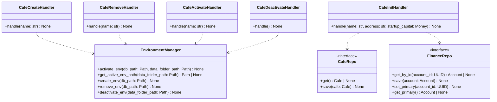

```mermaid
classDiagram
    %% ==========================================
    %% INTERFACES & SERVICES
    %% ==========================================
    class CafeRepo {
        <<interface>>
        +get() Cafe | None
        +save(cafe: Cafe) None
    }

    class FinanceRepo {
        <<interface>>
        +get_by_id(account_id: UUID) Account | None
        +save(account: Account) None
        +set_primary(account_id: UUID) None
        +get_primary() Account | None
    }

    class EnvironmentManager {
        +activate_env(db_path: Path, data_folder_path: Path) None
        +get_active_env_path(data_folder_path: Path) Path | None
        +create_env(db_path: Path) None
        +remove_env(db_path: Path) None
        +deactivate_env(data_folder_path: Path) None
    }

    %% ==========================================
    %% CAFE HANDLERS
    %% ==========================================
    class CafeCreateHandler {
        +handle(name: str) None
    }

    class CafeRemoveHandler {
        +handle(name: str) None
    }

    class CafeActivateHandler {
        +handle(name: str) None
    }

    class CafeDeactivateHandler {
        +handle() None
    }

    class CafeInitHandler {
        +handle(name: str, address: str, startup_capital: Money) None
    }

    %% Dependencies
    CafeCreateHandler ..> EnvironmentManager
    CafeRemoveHandler ..> EnvironmentManager
    CafeActivateHandler ..> EnvironmentManager
    CafeDeactivateHandler ..> EnvironmentManager
    CafeInitHandler ..> CafeRepo
    CafeInitHandler ..> FinanceRepo
```