# Cafe Manager CLI (Cafma)

A robust Command Line Interface (CLI) application for comprehensive cafe management built with Python

## Features

The application is divided into logical domains, each manageable via CLI subcommands:

*   **Environment (`cafe`)**: Support for multiple separate cafe databases (multi-tenancy).
*   **Finance (`finance`)**: Track budget, investments, transactions, and profit/loss statistics.
*   **Orders & Kitchen (`order`, `kitchen`)**: Full lifecycle of an order (awaiting payment -> paid -> cooking -> ready -> served).
*   **Menu & Inventory (`menu`, `inventory`)**: Manage menu items, recipes, ingredient supplies, and auto-deduct stocks during cooking.
*   **Equipment (`table`, `chair`, `machine`)**: Buy equipment, manage seating capacity, make reservations, and track coffee-machine maintenance.
*   **People (`employee`, `client`)**: Hire/fire staff, track employee workload, and manage client loyalty/spending.

## Technology Stack

*   **Language:** Python 3.11+
*   **CLI Framework:** [Typer](https://typer.tiangolo.com/)
*   **UI/Formatting:** [Rich](https://rich.readthedocs.io/) (for beautiful terminal tables and colored output)
*   **Database:** SQLite (built-in, with advanced custom Type Adapters for UUIDs, Datasets, and Value Objects)

## Installation

1. Clone the repository and navigate to the project directory:
   ```bash
   git clone https://github.com/Frog-with-Code/Cafe-manager
   cd cafe_manager
   ```

2. Create and activate a virtual environment:
   ```bash
   python -m venv .venv
   source .venv/bin/activate
   ```

3. Install package
    ```bash
    uv sync
    ```

## Quick Start

To start using the Cafe Manager, you need to create a database environment and initialize your cafe.

**1. Create and activate a new cafe environment:**
```bash
cafma create my_cafe
cafma cafe activate my_cafe
```

**2. Initialize the cafe (set name, address, and starting capital):**
```bash
cafma init --name "Central Perk" --address "New York" --capital 5000
```

**3. Explore available commands:**
Use the `--help` flag at any level to see available commands and options.
```bash
cafma --help
cafma order --help
cafma order create --help
```

### Basic Usage Example:
```bash
# Buy a table and chairs
cafma table buy --seats 4 --price 150
cafma chair buy --price 30

# Hire an employee
cafma employee hire --name "Gunther"

# Check finance stats
cafma finance stats
```

## Project Structure

The project strictly separates concerns:
*   `domain/`: Contains enterprise logic, Entities and Domain Services. Does not depend on any other layer.
*   `application/`: Contains Use Cases (Handlers) and Interfaces (Ports) for Repositories and Unit of Work.
*   `infrastructure/`: Contains SQLite implementations of Repositories, handling direct DB connections and SQL queries.
*   `cli/`: The presentation layer. Contains Typer setups, data validation, and console rendering using Rich.


## Class diagram
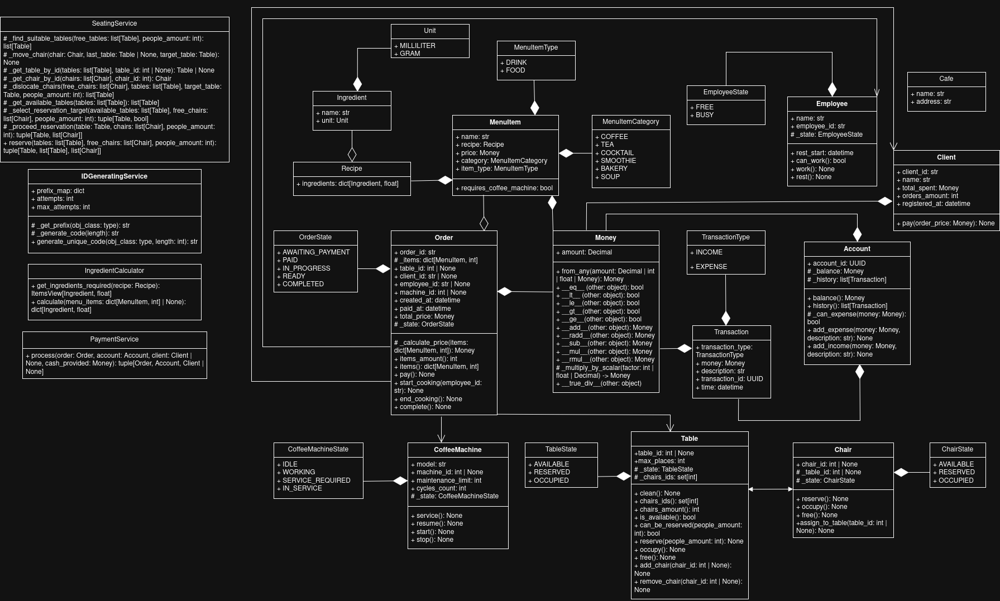
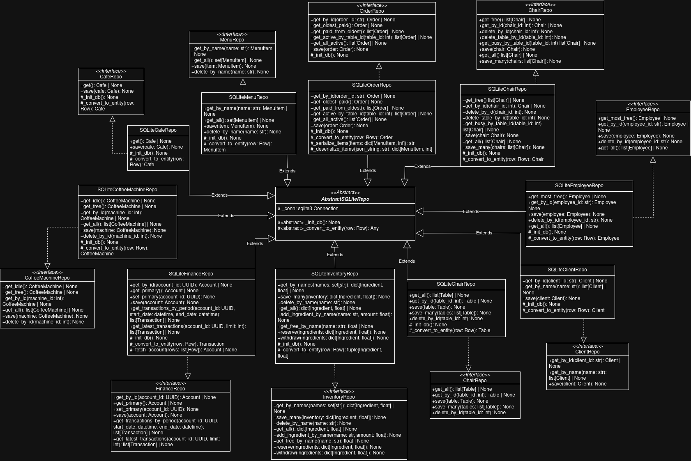


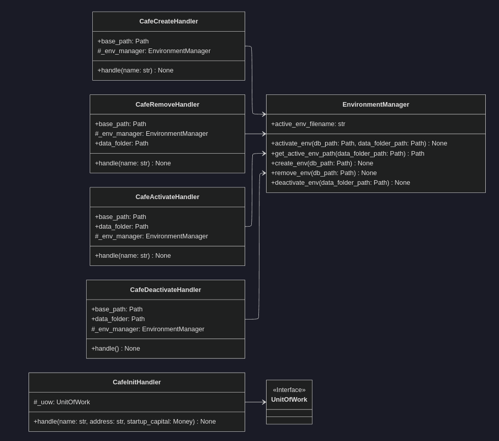
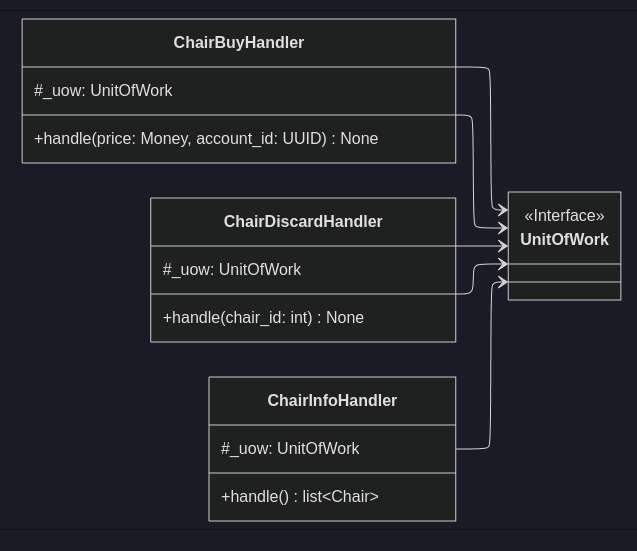
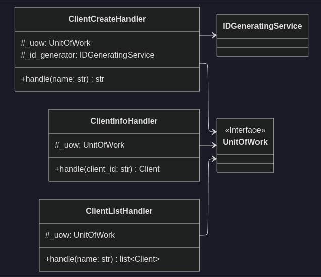
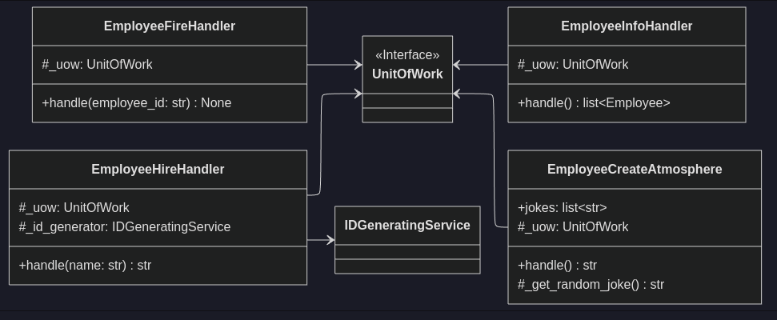
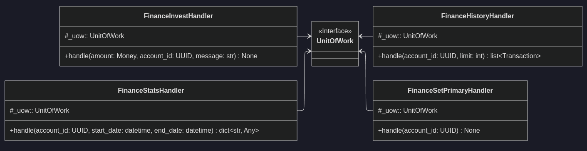
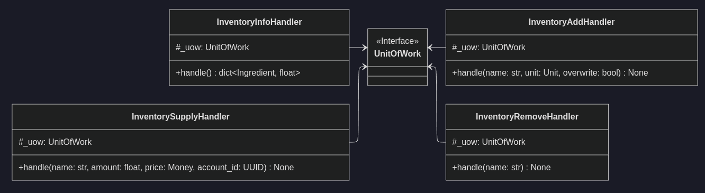
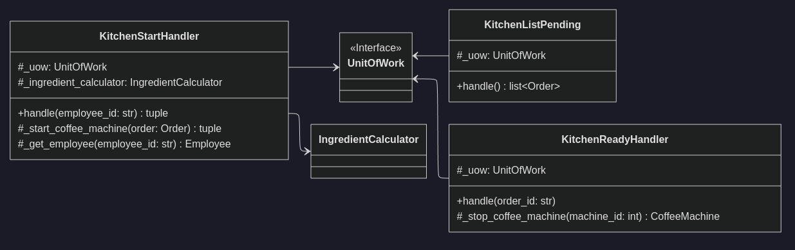
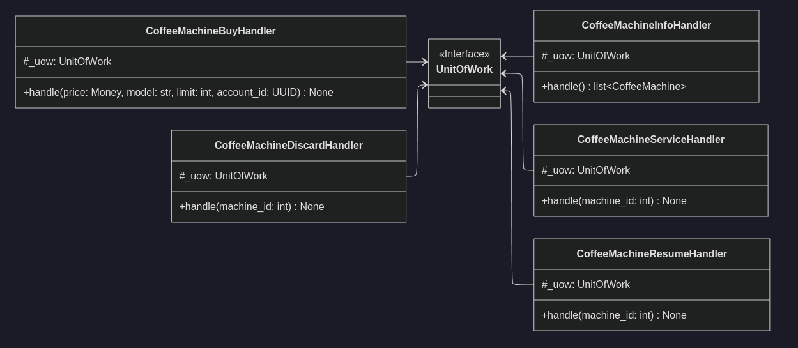
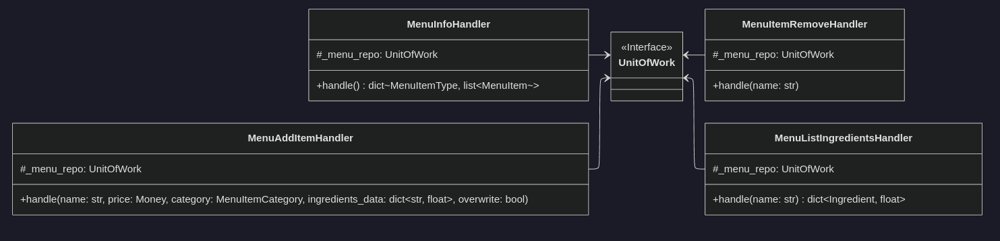
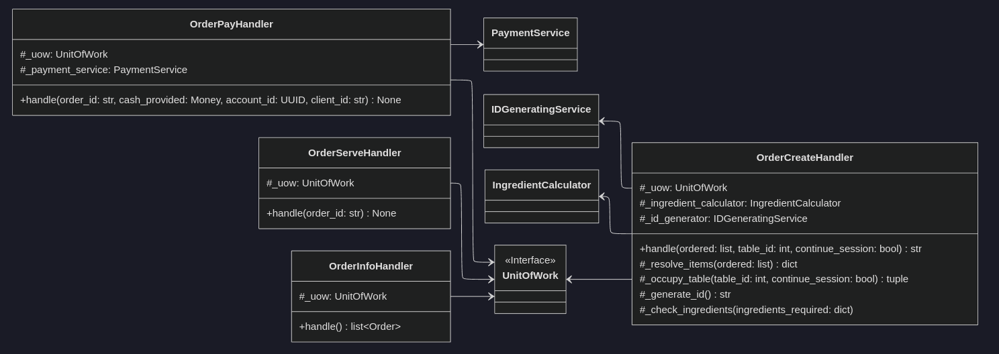
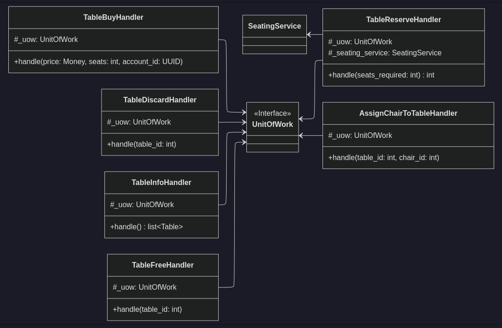

## Statechart diagram


