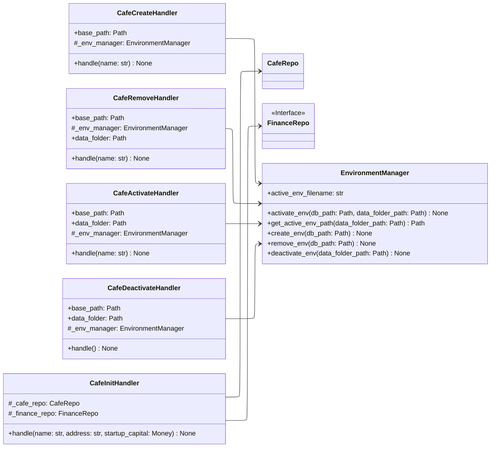

```mermaid
---
config:
  layout: elk
---

classDiagram
    direction LR
    class CafeRepo {
    }

    class FinanceRepo {
        <<Interface>>
    }

    class EnvironmentManager {
        +active_env_filename: str
        +activate_env(db_path: Path, data_folder_path: Path) None
        +get_active_env_path(data_folder_path: Path) Path
        +create_env(db_path: Path) None
        +remove_env(db_path: Path) None
        +deactivate_env(data_folder_path: Path) None
    }

    class CafeCreateHandler {
        +base_path: Path
        #_env_manager: EnvironmentManager
        +handle(name: str) None
    }

    class CafeRemoveHandler {
        +base_path: Path
        #_env_manager: EnvironmentManager
        +data_folder: Path
        +handle(name: str) None
    }

    class CafeActivateHandler {
        +base_path: Path
        +data_folder: Path
        #_env_manager: EnvironmentManager
        +handle(name: str) None
    }

    class CafeDeactivateHandler {
        +base_path: Path
        +data_folder: Path
        #_env_manager: EnvironmentManager
        +handle() None
    }

    class CafeInitHandler {
        #_cafe_repo: CafeRepo
        #_finance_repo: FinanceRepo
        +handle(name: str, address: str, startup_capital: Money) None
    }


    CafeCreateHandler --> EnvironmentManager
    CafeRemoveHandler --> EnvironmentManager
    CafeActivateHandler --> EnvironmentManager
    CafeDeactivateHandler --> EnvironmentManager
    CafeInitHandler --> CafeRepo
    CafeInitHandler --> FinanceRepo
```