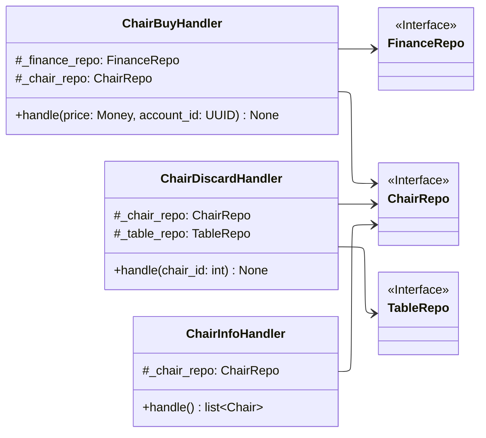

```mermaid
---
config:
  layout: elk
---

classDiagram
    direction LR
    class FinanceRepo {
        <<Interface>>
    }

    class ChairRepo {
        <<Interface>>
    }

    class TableRepo {
        <<Interface>>
    }

    class ChairBuyHandler {
        #_finance_repo: FinanceRepo
        #_chair_repo: ChairRepo
        +handle(price: Money, account_id: UUID) None
    }

    class ChairDiscardHandler {
        #_chair_repo: ChairRepo
        #_table_repo: TableRepo
        +handle(chair_id: int) None
    }

    class ChairInfoHandler {
        #_chair_repo: ChairRepo
        +handle() list~Chair~
    }

    ChairBuyHandler --> FinanceRepo
    ChairBuyHandler --> ChairRepo
    ChairDiscardHandler --> ChairRepo
    ChairDiscardHandler --> TableRepo
    ChairInfoHandler --> ChairRepo
```