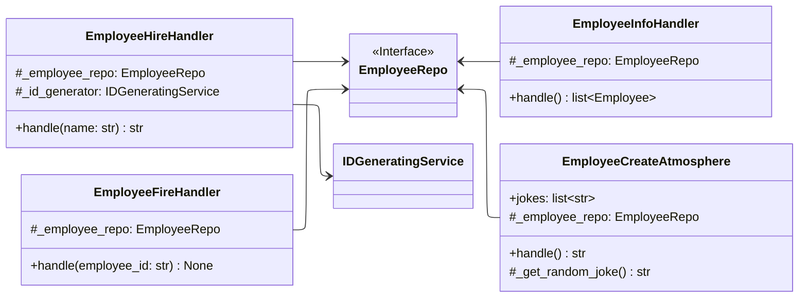

```mermaid
---
config:
  layout: elk
---

classDiagram
    direction LR
    class EmployeeRepo {
        <<Interface>>
    }

    class IDGeneratingService {
    }

    class EmployeeHireHandler {
        #_employee_repo: EmployeeRepo
        #_id_generator: IDGeneratingService
        +handle(name: str) str
    }

    class EmployeeFireHandler {
        #_employee_repo: EmployeeRepo
        +handle(employee_id: str) None
    }

    class EmployeeInfoHandler {
        #_employee_repo: EmployeeRepo
        +handle() list~Employee~
    }

    class EmployeeCreateAtmosphere {
        +jokes: list~str~
        #_employee_repo: EmployeeRepo
        +handle() str
        #_get_random_joke() str
    }

    EmployeeHireHandler --> EmployeeRepo
    EmployeeHireHandler --> IDGeneratingService
    EmployeeFireHandler --> EmployeeRepo

    EmployeeRepo <-- EmployeeInfoHandler
    EmployeeRepo <-- EmployeeCreateAtmosphere
```