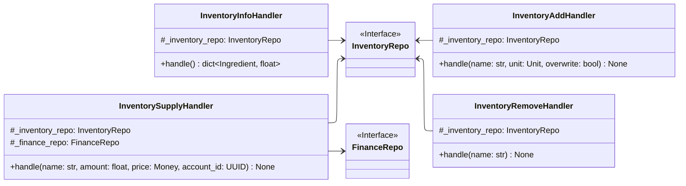

```mermaid
---
config:
  layout: elk
---

classDiagram
    direction LR
    class InventoryRepo {
        <<Interface>>
    }

    class FinanceRepo {
        <<Interface>>
    }

    class InventoryAddHandler {
        #_inventory_repo: InventoryRepo
        +handle(name: str, unit: Unit, overwrite: bool) None
    }

    class InventoryRemoveHandler {
        #_inventory_repo: InventoryRepo
        +handle(name: str) None
    }

    class InventoryInfoHandler {
        #_inventory_repo: InventoryRepo
        +handle() dict~Ingredient, float~
    }

    class InventorySupplyHandler {
        #_inventory_repo: InventoryRepo
        #_finance_repo: FinanceRepo
        +handle(name: str, amount: float, price: Money, account_id: UUID) None
    }


    InventoryRepo <-- InventoryAddHandler
    InventoryRepo <-- InventoryRemoveHandler

    InventoryInfoHandler --> InventoryRepo
    InventorySupplyHandler --> InventoryRepo
    InventorySupplyHandler --> FinanceRepo
```
