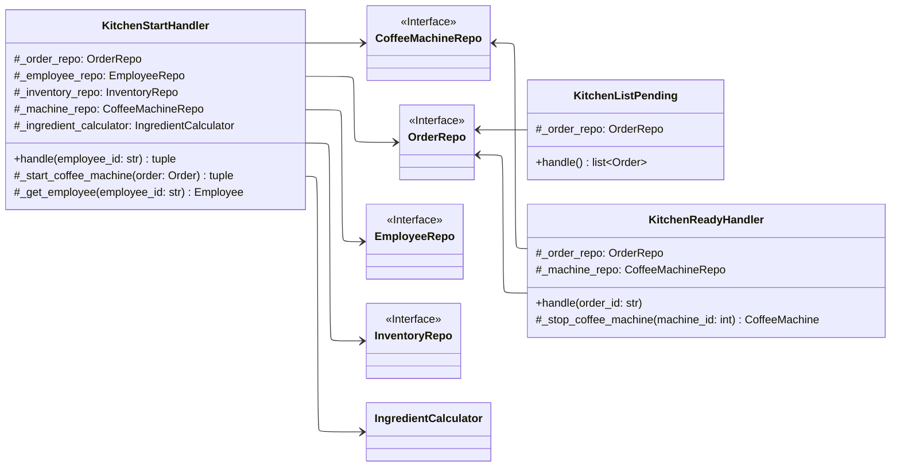

```mermaid
---
config:
  layout: elk
---

classDiagram
    direction LR
    class CoffeeMachineRepo {
        <<Interface>>
    }


    class OrderRepo {
        <<Interface>>
    }

    class EmployeeRepo {
        <<Interface>>
    }

    class InventoryRepo {
        <<Interface>>
    }

    class IngredientCalculator {
    }


    class KitchenStartHandler {
        #_order_repo: OrderRepo
        #_employee_repo: EmployeeRepo
        #_inventory_repo: InventoryRepo
        #_machine_repo: CoffeeMachineRepo
        #_ingredient_calculator: IngredientCalculator
        +handle(employee_id: str) tuple
        #_start_coffee_machine(order: Order) tuple
        #_get_employee(employee_id: str) Employee
    }

    class KitchenListPending {
        #_order_repo: OrderRepo
        +handle() list~Order~
    }

    class KitchenReadyHandler {
        #_order_repo: OrderRepo
        #_machine_repo: CoffeeMachineRepo
        +handle(order_id: str)
        #_stop_coffee_machine(machine_id: int) CoffeeMachine
    }

    KitchenStartHandler --> OrderRepo
    KitchenStartHandler --> EmployeeRepo
    KitchenStartHandler --> InventoryRepo
    KitchenStartHandler --> CoffeeMachineRepo
    KitchenStartHandler --> IngredientCalculator

    OrderRepo <-- KitchenListPending 
    OrderRepo <-- KitchenReadyHandler
    CoffeeMachineRepo <-- KitchenReadyHandler 

```