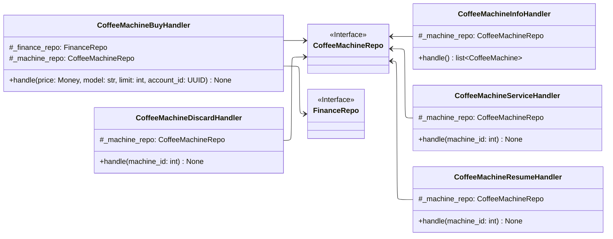

```mermaid
---
config:
  layout: elk
---

classDiagram
    direction LR
    class CoffeeMachineRepo {
        <<Interface>>
    }

    class FinanceRepo {
        <<Interface>>
    }

    class CoffeeMachineBuyHandler {
        #_finance_repo: FinanceRepo
        #_machine_repo: CoffeeMachineRepo
        +handle(price: Money, model: str, limit: int, account_id: UUID) None
    }

    class CoffeeMachineDiscardHandler {
        #_machine_repo: CoffeeMachineRepo
        +handle(machine_id: int) None
    }

    class CoffeeMachineInfoHandler {
        #_machine_repo: CoffeeMachineRepo
        +handle() list~CoffeeMachine~
    }

    class CoffeeMachineServiceHandler {
        #_machine_repo: CoffeeMachineRepo
        +handle(machine_id: int) None
    }

    class CoffeeMachineResumeHandler {
        #_machine_repo: CoffeeMachineRepo
        +handle(machine_id: int) None
    }

    CoffeeMachineBuyHandler --> FinanceRepo
    CoffeeMachineBuyHandler --> CoffeeMachineRepo
    CoffeeMachineDiscardHandler --> CoffeeMachineRepo

    CoffeeMachineRepo <-- CoffeeMachineInfoHandler
    CoffeeMachineRepo <-- CoffeeMachineServiceHandler
    CoffeeMachineRepo <-- CoffeeMachineResumeHandler

```