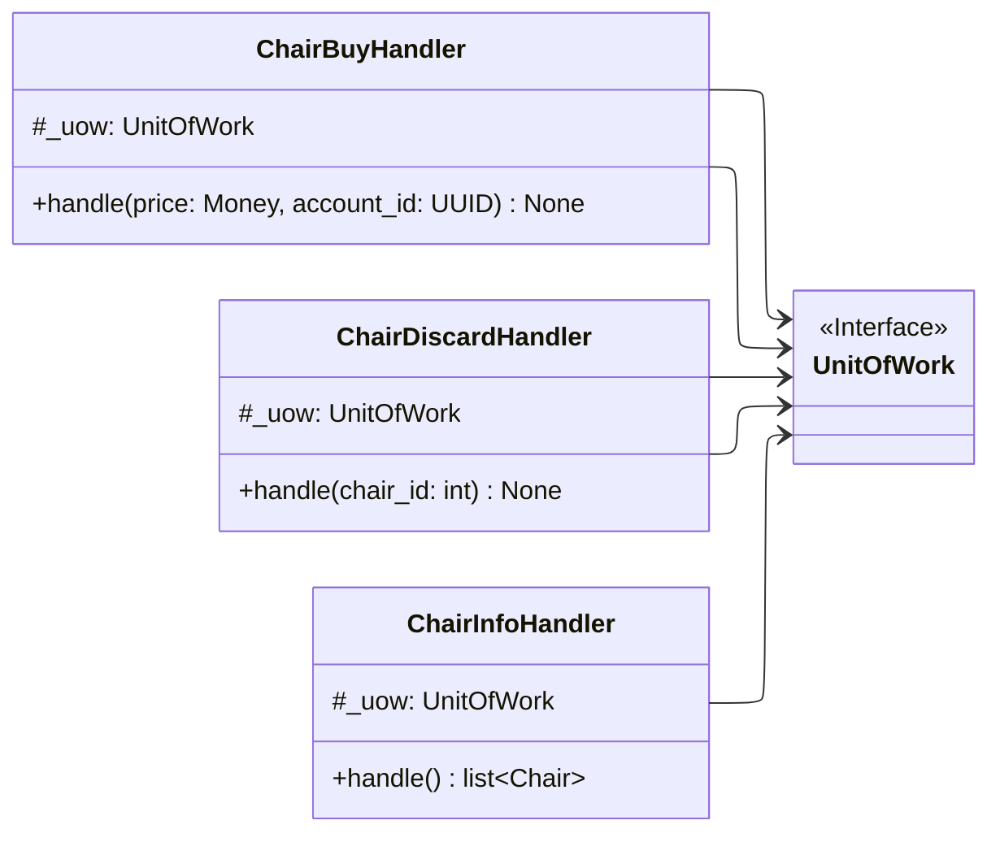

```mermaid
---
config:
  layout: elk
---

classDiagram
    direction LR
    class UnitOfWork {
        <<Interface>>
    }

    class ChairBuyHandler {
        #_uow: UnitOfWork
        +handle(price: Money, account_id: UUID) None
    }

    class ChairDiscardHandler {
        #_uow: UnitOfWork
        +handle(chair_id: int) None
    }

    class ChairInfoHandler {
        #_uow: UnitOfWork
        +handle() list~Chair~
    }

    ChairBuyHandler --> UnitOfWork
    ChairBuyHandler --> UnitOfWork
    ChairDiscardHandler --> UnitOfWork
    ChairDiscardHandler --> UnitOfWork
    ChairInfoHandler --> UnitOfWork
```