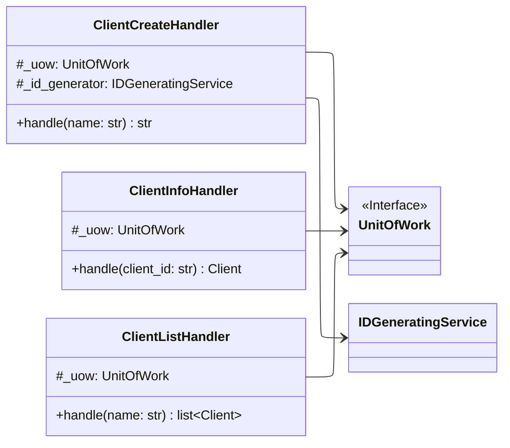

```mermaid
---
config:
  layout: elk
---

classDiagram
direction LR

class UnitOfWork {
<<Interface>>
}

class IDGeneratingService {

}

class ClientCreateHandler {
    #_uow: UnitOfWork
    #_id_generator: IDGeneratingService
    +handle(name: str) str
}

class ClientInfoHandler {
    #_uow: UnitOfWork
    +handle(client_id: str) Client
}

class ClientListHandler {
    #_uow: UnitOfWork
    +handle(name: str) list~Client~
}

ClientCreateHandler --> UnitOfWork
ClientCreateHandler --> IDGeneratingService
ClientInfoHandler --> UnitOfWork
ClientListHandler --> UnitOfWork
```