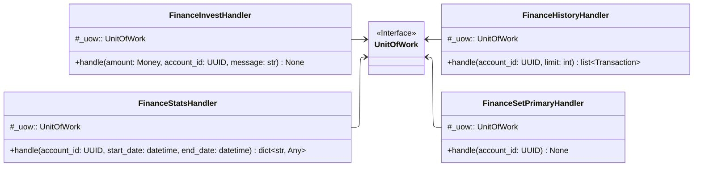

```mermaid
---
config:
  layout: elk
---

classDiagram
    direction LR
    class UnitOfWork {
        <<Interface>>
    }

    class FinanceInvestHandler {
        #_uow:: UnitOfWork
        +handle(amount: Money, account_id: UUID, message: str) None
    }

    class FinanceStatsHandler {
        #_uow:: UnitOfWork
        +handle(account_id: UUID, start_date: datetime, end_date: datetime) dict~str, Any~
    }

    class FinanceHistoryHandler {
        #_uow:: UnitOfWork
        +handle(account_id: UUID, limit: int) list~Transaction~
    }

    class FinanceSetPrimaryHandler {
        #_uow:: UnitOfWork
        +handle(account_id: UUID) None
    }

    FinanceInvestHandler --> UnitOfWork
    FinanceStatsHandler --> UnitOfWork

    UnitOfWork <-- FinanceHistoryHandler
    UnitOfWork <-- FinanceSetPrimaryHandler

```