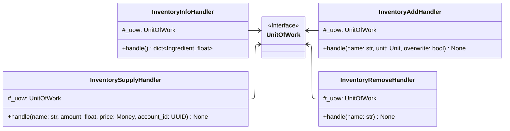

```mermaid
---
config:
  layout: elk
---

classDiagram
    direction LR
    class UnitOfWork {
        <<Interface>>
    }

    class InventoryAddHandler {
        #_uow: UnitOfWork
        +handle(name: str, unit: Unit, overwrite: bool) None
    }

    class InventoryRemoveHandler {
        #_uow: UnitOfWork
        +handle(name: str) None
    }

    class InventoryInfoHandler {
        #_uow: UnitOfWork
        +handle() dict~Ingredient, float~
    }

    class InventorySupplyHandler {
        #_uow: UnitOfWork
        +handle(name: str, amount: float, price: Money, account_id: UUID) None
    }


    UnitOfWork <-- InventoryAddHandler
    UnitOfWork <-- InventoryRemoveHandler

    InventoryInfoHandler --> UnitOfWork
    InventorySupplyHandler --> UnitOfWork
```
