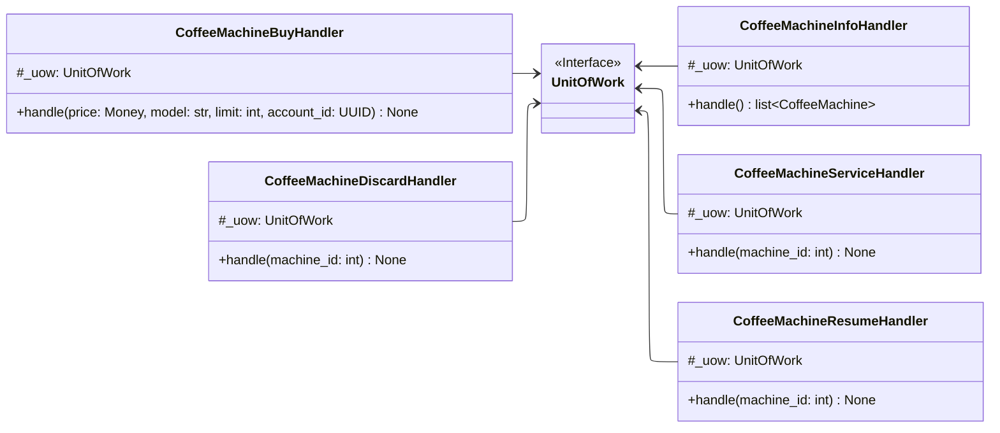

```mermaid
---
config:
  layout: elk
---

classDiagram
    direction LR
    class UnitOfWork {
        <<Interface>>
    }

    class CoffeeMachineBuyHandler {
        #_uow: UnitOfWork
        +handle(price: Money, model: str, limit: int, account_id: UUID) None
    }

    class CoffeeMachineDiscardHandler {
        #_uow: UnitOfWork
        +handle(machine_id: int) None
    }

    class CoffeeMachineInfoHandler {
        #_uow: UnitOfWork
        +handle() list~CoffeeMachine~
    }

    class CoffeeMachineServiceHandler {
        #_uow: UnitOfWork
        +handle(machine_id: int) None
    }

    class CoffeeMachineResumeHandler {
        #_uow: UnitOfWork
        +handle(machine_id: int) None
    }

    CoffeeMachineBuyHandler --> UnitOfWork
    CoffeeMachineDiscardHandler --> UnitOfWork

    UnitOfWork <-- CoffeeMachineInfoHandler
    UnitOfWork <-- CoffeeMachineServiceHandler
    UnitOfWork <-- CoffeeMachineResumeHandler

```