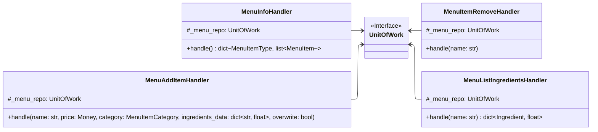

```mermaid
---
config:
  layout: elk
---

classDiagram
    direction LR
    class UnitOfWork {
        <<Interface>>
    }

    class MenuInfoHandler {
        #_menu_repo: UnitOfWork
        +handle() dict~MenuItemType, list~MenuItem~~
    }

    class MenuAddItemHandler {
        #_menu_repo: UnitOfWork
        +handle(name: str, price: Money, category: MenuItemCategory, ingredients_data: dict~str, float~, overwrite: bool)
    }

    class MenuItemRemoveHandler {
        #_menu_repo: UnitOfWork
        +handle(name: str)
    }

    class MenuListIngredientsHandler {
        #_menu_repo: UnitOfWork
        +handle(name: str) dict~Ingredient, float~
    }

    MenuInfoHandler --> UnitOfWork
    MenuAddItemHandler --> UnitOfWork

    UnitOfWork <-- MenuItemRemoveHandler
    UnitOfWork <-- MenuListIngredientsHandler
```