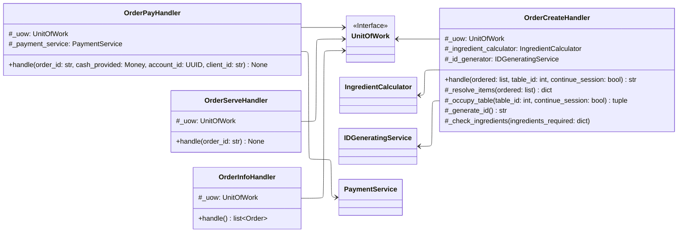

```mermaid
---
config:
  layout: elk
---

classDiagram
    direction LR

    class UnitOfWork {
        <<Interface>>
    }

    class IngredientCalculator {
    }

    class IDGeneratingService {
    }

    class PaymentService {
    }

    class OrderCreateHandler {
        #_uow: UnitOfWork
        #_ingredient_calculator: IngredientCalculator
        #_id_generator: IDGeneratingService
        +handle(ordered: list, table_id: int, continue_session: bool) str
        #_resolve_items(ordered: list) dict
        #_occupy_table(table_id: int, continue_session: bool) tuple
        #_generate_id() str
        #_check_ingredients(ingredients_required: dict)
    }

    class OrderPayHandler {
        #_uow: UnitOfWork
        #_payment_service: PaymentService
        +handle(order_id: str, cash_provided: Money, account_id: UUID, client_id: str) None
    }

    class OrderServeHandler {
        #_uow: UnitOfWork
        +handle(order_id: str) None
    }

    class OrderInfoHandler {
        #_uow: UnitOfWork
        +handle() list~Order~
    }

    UnitOfWork <-- OrderCreateHandler
    IngredientCalculator <-- OrderCreateHandler
    IDGeneratingService <-- OrderCreateHandler

    OrderPayHandler --> UnitOfWork
    OrderPayHandler --> PaymentService

    OrderServeHandler --> UnitOfWork

    OrderInfoHandler --> UnitOfWork

```