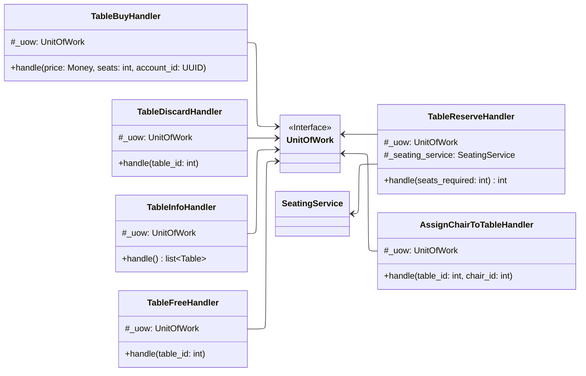

```mermaid
---
config:
  layout: elk
---

classDiagram
    direction LR
    class UnitOfWork {
        <<Interface>>
    }

    class SeatingService {
    }

    class TableBuyHandler {
        #_uow: UnitOfWork
        +handle(price: Money, seats: int, account_id: UUID)
    }

    class TableDiscardHandler {
        #_uow: UnitOfWork
        +handle(table_id: int)
    }

    class TableInfoHandler {
        #_uow: UnitOfWork
        +handle() list~Table~
    }

    class TableReserveHandler {
        #_uow: UnitOfWork
        #_seating_service: SeatingService
        +handle(seats_required: int) int
    }

    class AssignChairToTableHandler {
        #_uow: UnitOfWork
        +handle(table_id: int, chair_id: int)
    }

    class TableFreeHandler {
        #_uow: UnitOfWork
        +handle(table_id: int)
    }

    TableBuyHandler --> UnitOfWork

    TableDiscardHandler --> UnitOfWork

    TableInfoHandler --> UnitOfWork

    UnitOfWork <-- TableReserveHandler
    SeatingService <-- TableReserveHandler

    UnitOfWork <-- AssignChairToTableHandler

    TableFreeHandler --> UnitOfWork

```    