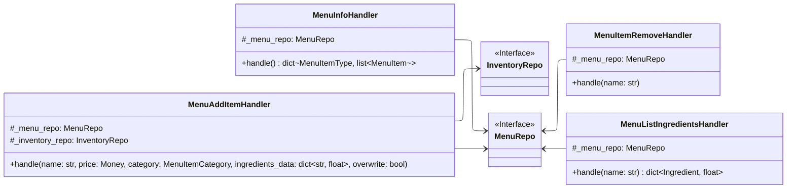

```mermaid
---
config:
  layout: elk
---

classDiagram
    direction LR
    class InventoryRepo {
        <<Interface>>
    }

    class MenuRepo {
        <<Interface>>
    }

    class MenuInfoHandler {
        #_menu_repo: MenuRepo
        +handle() dict~MenuItemType, list~MenuItem~~
    }

    class MenuAddItemHandler {
        #_menu_repo: MenuRepo
        #_inventory_repo: InventoryRepo
        +handle(name: str, price: Money, category: MenuItemCategory, ingredients_data: dict~str, float~, overwrite: bool)
    }

    class MenuItemRemoveHandler {
        #_menu_repo: MenuRepo
        +handle(name: str)
    }

    class MenuListIngredientsHandler {
        #_menu_repo: MenuRepo
        +handle(name: str) dict~Ingredient, float~
    }

    MenuInfoHandler --> MenuRepo
    MenuAddItemHandler --> MenuRepo
    MenuAddItemHandler --> InventoryRepo

    MenuRepo <-- MenuItemRemoveHandler
    MenuRepo <-- MenuListIngredientsHandler
```