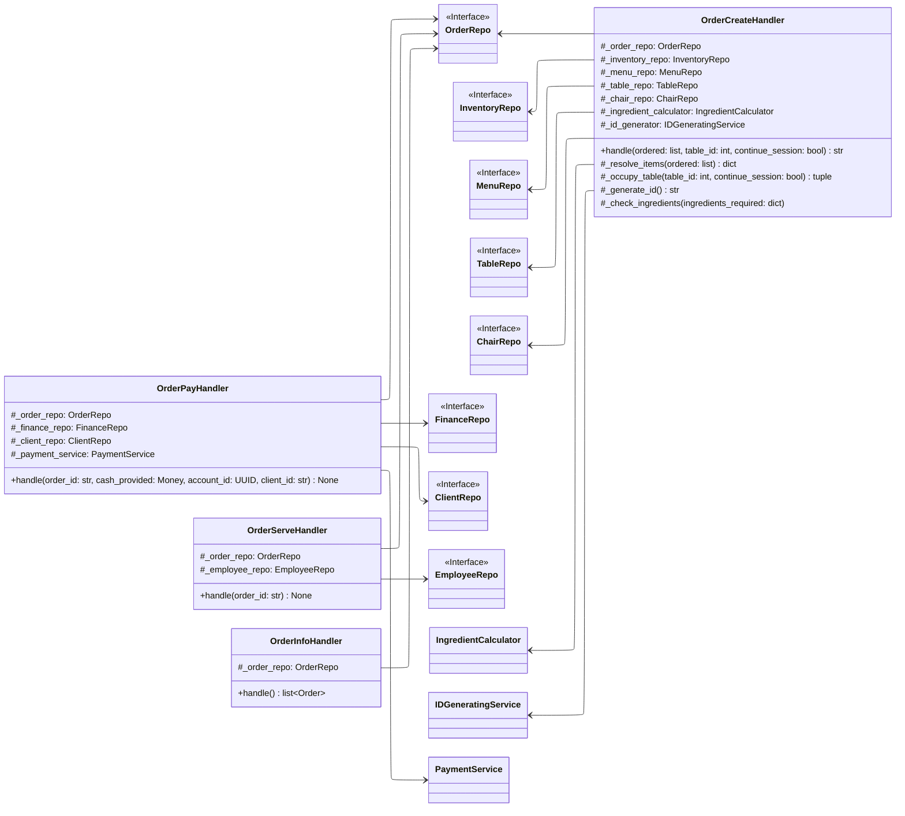

```mermaid
---
config:
  layout: elk
---

classDiagram
    direction LR

    class OrderRepo {
        <<Interface>>
    }

    class InventoryRepo {
        <<Interface>>
    }

    class MenuRepo {
        <<Interface>>
    }

    class TableRepo {
        <<Interface>>
    }

    class ChairRepo {
        <<Interface>>
    }

    class FinanceRepo {
        <<Interface>>
    }

    class ClientRepo {
        <<Interface>>
    }

    class EmployeeRepo {
        <<Interface>>
    }

    class IngredientCalculator {
    }

    class IDGeneratingService {
    }

    class PaymentService {
    }

    class OrderCreateHandler {
        #_order_repo: OrderRepo
        #_inventory_repo: InventoryRepo
        #_menu_repo: MenuRepo
        #_table_repo: TableRepo
        #_chair_repo: ChairRepo
        #_ingredient_calculator: IngredientCalculator
        #_id_generator: IDGeneratingService
        +handle(ordered: list, table_id: int, continue_session: bool) str
        #_resolve_items(ordered: list) dict
        #_occupy_table(table_id: int, continue_session: bool) tuple
        #_generate_id() str
        #_check_ingredients(ingredients_required: dict)
    }

    class OrderPayHandler {
        #_order_repo: OrderRepo
        #_finance_repo: FinanceRepo
        #_client_repo: ClientRepo
        #_payment_service: PaymentService
        +handle(order_id: str, cash_provided: Money, account_id: UUID, client_id: str) None
    }

    class OrderServeHandler {
        #_order_repo: OrderRepo
        #_employee_repo: EmployeeRepo
        +handle(order_id: str) None
    }

    class OrderInfoHandler {
        #_order_repo: OrderRepo
        +handle() list~Order~
    }

    OrderRepo <-- OrderCreateHandler
    InventoryRepo <-- OrderCreateHandler
    MenuRepo <-- OrderCreateHandler
    TableRepo <-- OrderCreateHandler
    ChairRepo <-- OrderCreateHandler
    IngredientCalculator <-- OrderCreateHandler
    IDGeneratingService <-- OrderCreateHandler

    OrderPayHandler --> OrderRepo
    OrderPayHandler --> FinanceRepo
    OrderPayHandler --> ClientRepo
    OrderPayHandler --> PaymentService

    OrderServeHandler --> OrderRepo
    OrderServeHandler --> EmployeeRepo

    OrderInfoHandler --> OrderRepo

```