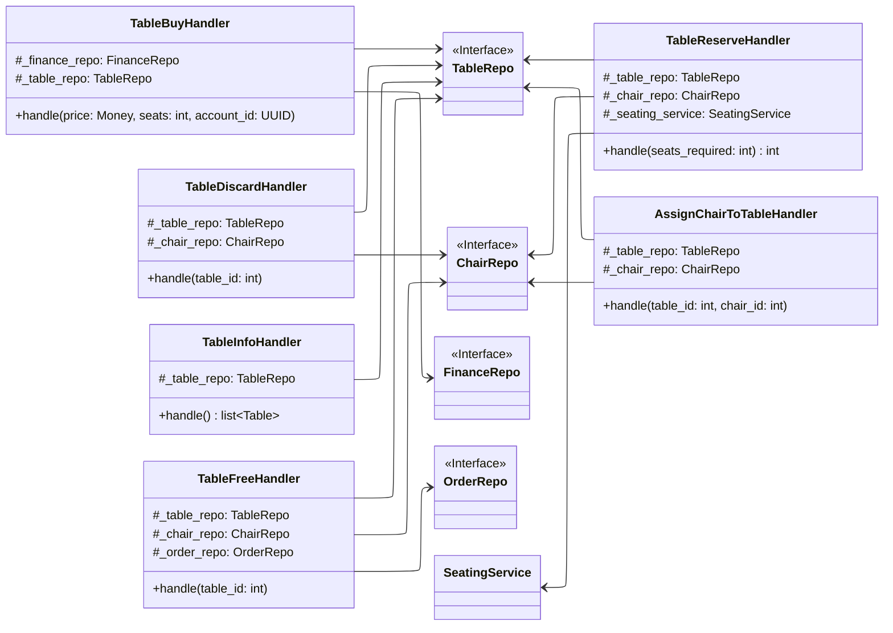

```mermaid
---
config:
  layout: elk
---

classDiagram
    direction LR
    class TableRepo {
        <<Interface>>
    }

    class ChairRepo {
        <<Interface>>
    }

    class FinanceRepo {
        <<Interface>>
    }

    class OrderRepo {
        <<Interface>>
    }

    class SeatingService {
    }

    class TableBuyHandler {
        #_finance_repo: FinanceRepo
        #_table_repo: TableRepo
        +handle(price: Money, seats: int, account_id: UUID)
    }

    class TableDiscardHandler {
        #_table_repo: TableRepo
        #_chair_repo: ChairRepo
        +handle(table_id: int)
    }

    class TableInfoHandler {
        #_table_repo: TableRepo
        +handle() list~Table~
    }

    class TableReserveHandler {
        #_table_repo: TableRepo
        #_chair_repo: ChairRepo
        #_seating_service: SeatingService
        +handle(seats_required: int) int
    }

    class AssignChairToTableHandler {
        #_table_repo: TableRepo
        #_chair_repo: ChairRepo
        +handle(table_id: int, chair_id: int)
    }

    class TableFreeHandler {
        #_table_repo: TableRepo
        #_chair_repo: ChairRepo
        #_order_repo: OrderRepo
        +handle(table_id: int)
    }

    TableBuyHandler --> FinanceRepo
    TableBuyHandler --> TableRepo

    TableDiscardHandler --> TableRepo
    TableDiscardHandler --> ChairRepo

    TableInfoHandler --> TableRepo

    TableRepo <-- TableReserveHandler
    ChairRepo <-- TableReserveHandler
    SeatingService <-- TableReserveHandler

    TableRepo <-- AssignChairToTableHandler
    ChairRepo <-- AssignChairToTableHandler

    TableFreeHandler --> TableRepo
    TableFreeHandler --> ChairRepo
    TableFreeHandler --> OrderRepo

```    