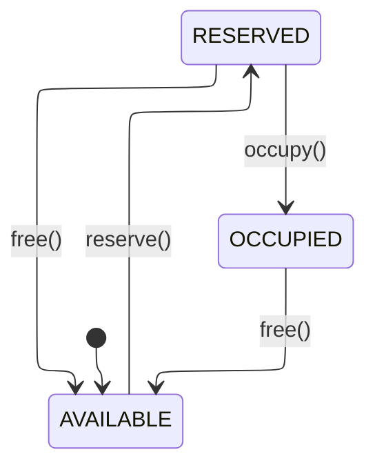

```mermaid
---
config:
  layout: elk
---

stateDiagram-v2
    [*] --> AVAILABLE
    
    AVAILABLE --> RESERVED : reserve()
    
    RESERVED --> OCCUPIED : occupy()
    
    OCCUPIED --> AVAILABLE : free()
    RESERVED --> AVAILABLE : free()
```