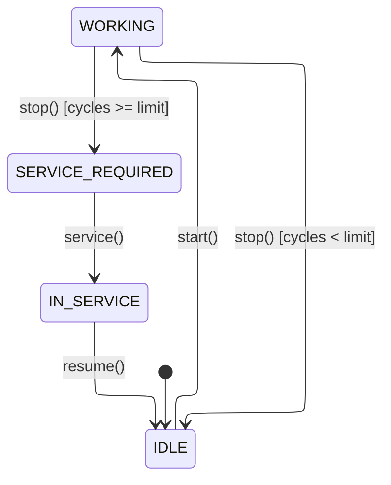

```mermaid
---
config:
  layout: elk
---

stateDiagram-v2
    [*] --> IDLE
    
    IDLE --> WORKING : start()
    
    WORKING --> IDLE : stop() [cycles < limit]
    
    WORKING --> SERVICE_REQUIRED : stop() [cycles >= limit]
    
    SERVICE_REQUIRED --> IN_SERVICE : service()
    
    IN_SERVICE --> IDLE : resume()

```