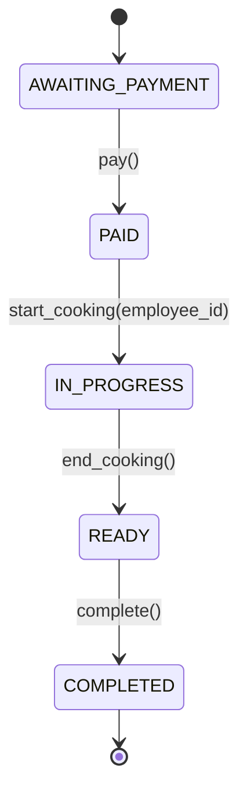

```mermaid
---
config:
  layout: elk
---

stateDiagram-v2

    [*] --> AWAITING_PAYMENT
    
    AWAITING_PAYMENT --> PAID : pay()
    
    PAID --> IN_PROGRESS : start_cooking(employee_id)
    
    IN_PROGRESS --> READY : end_cooking()
    
    READY --> COMPLETED : complete()
    
    COMPLETED --> [*]
```